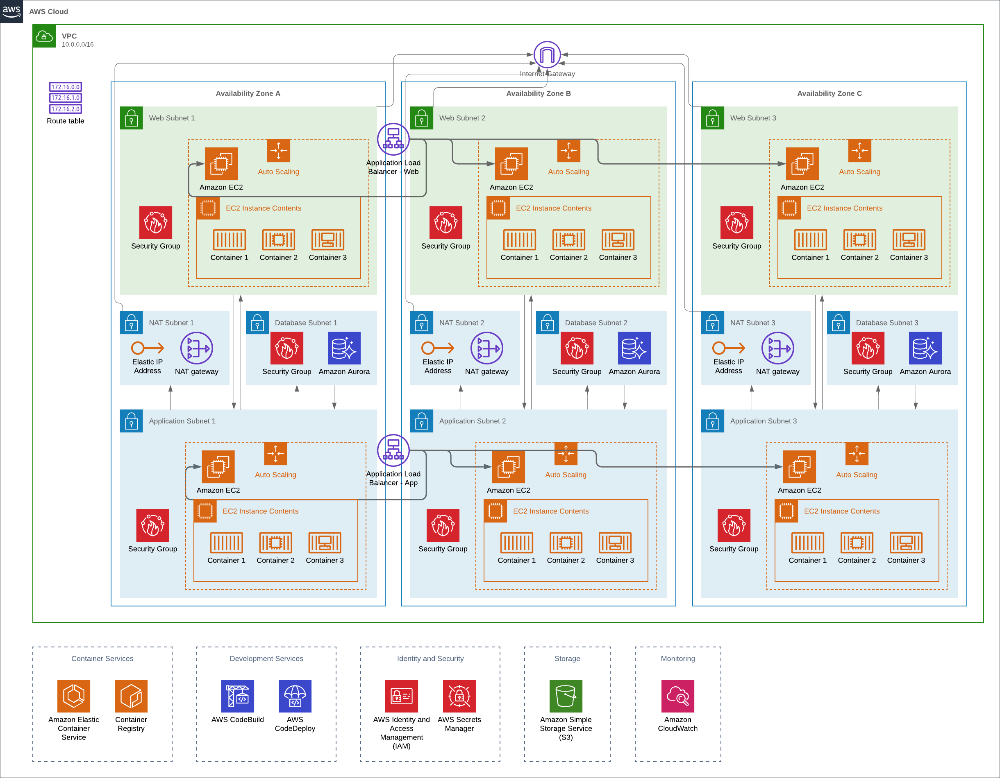

# Refactoring Infrastructure as Code Into Smaller Projects for Improved Automation

By
## Ahmed Dirie

This GIT Repository contains the IT artefact for the dissesrtation submitted to the University of Liverpool in partial fulfillment of the requirements for the degree of Master of Science in Advanced Computer Science.

## IT Artefact

The IT Artefact consists of the following two directories.

### Modules

The modules directory contains the scripts that connect to the AWS API and executes operations. The modules in this directory are called by the projects folder which passes it configuration parameters which are then provisioned on AWS.

### Projects

The projects directory contains the Infrastructure as Code for both the Singular and Refactored Project.

## Cloud Architecture

The architecture of both projects are based on the following design.

